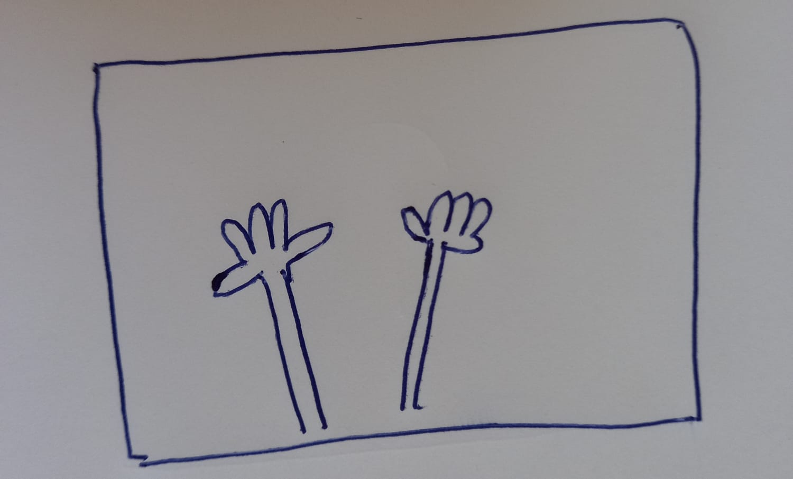
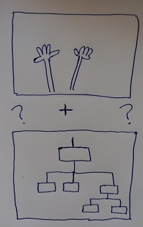
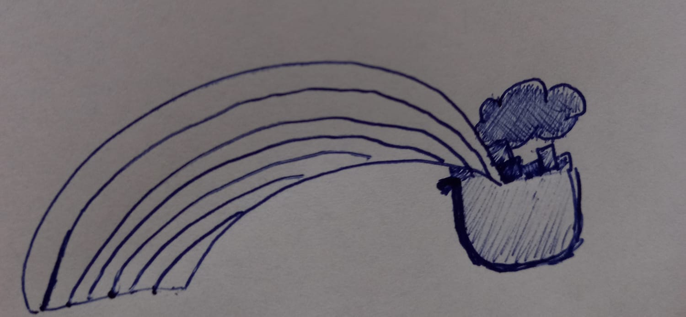
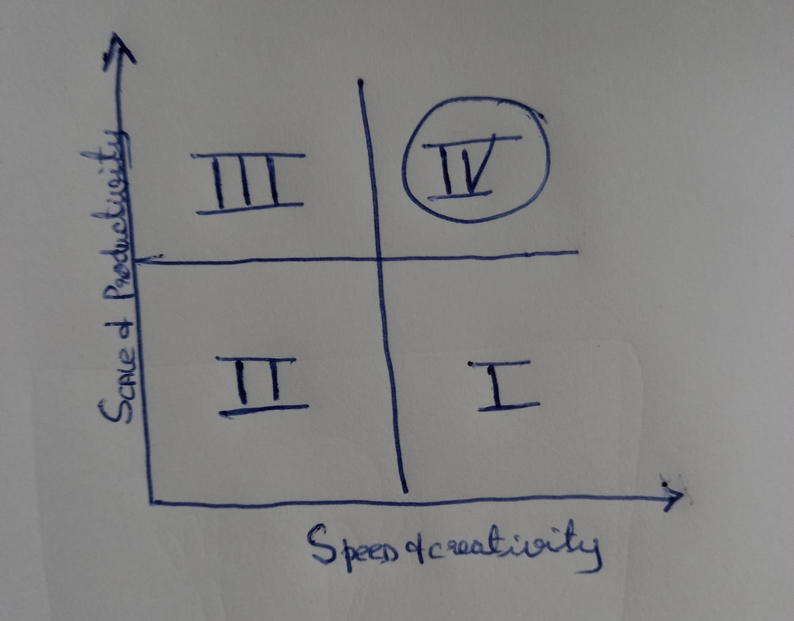
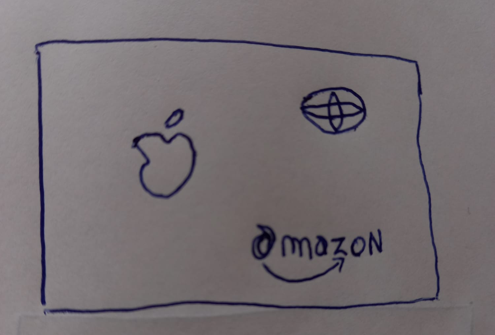
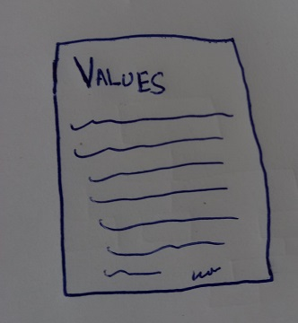
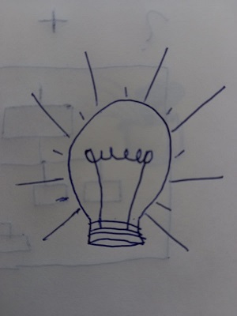
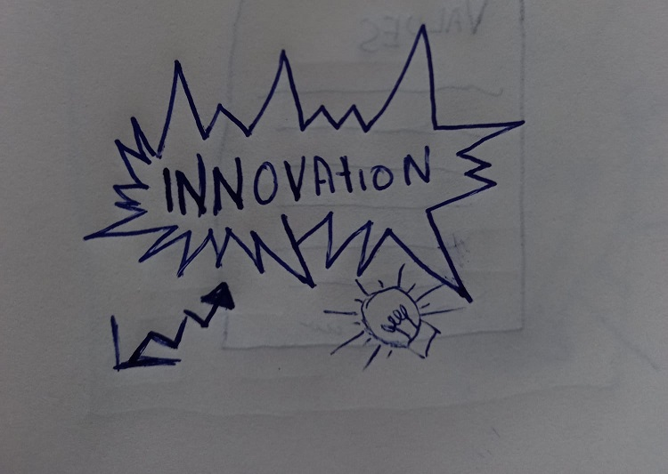
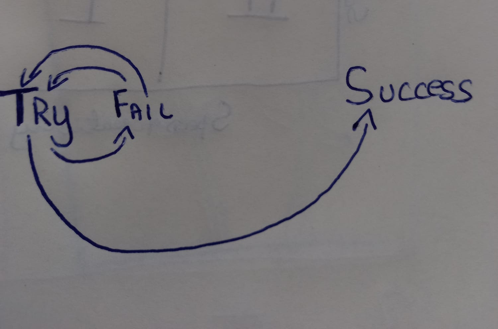

# Ambidextrous organizations

By Afshan Ahmed

Date: 22.03.2022

<!-- .slide: data-background="./back.jpg" -->

---

## So, what is an ambidextrous organization?

## <!-- .slide: data-background="./back.jpg" -->

---

Ambidextrous or Ambidexterity can be defined as the ability of an individual to use both hands equally well.

 <!-- .slide: data-background="./back.jpg" -->

---

Now that we know what Ambidexterity is, how does this translate in the context of an organization ?

<!-- .slide: data-background="./back.jpg" -->

---

Ambidextrous organizations can be defined as organizations where executives **explore** new possibilities while at the same time making sure to **exploit** current capabilities.

## <!-- .slide: data-background="./back.jpg" -->

---

What does this mean you might ask..

<!-- .slide: data-background="./back.jpg" -->

---

Simply put,

Organizations that **focus on the future** without losing sight of what **opportunities** lie ahead of them.

## <!-- .slide: data-background="./back.jpg" -->

---

## 

## <!-- .slide: data-background="./back.jpg" -->

---

Now that we know what **ambidextrous organizations** are lets look at the different kinds

## <!-- .slide: data-background="./back.jpg" -->

---

## Temporal ambidexterity

The **explorative** and and **exploitative** forms alternate and are not present simultaneously

## <!-- .slide: data-background="./back.jpg" -->

---

## Contextual ambidexterity

In this kind of organization, both forms occur at the same time but the organizational factors **change on the basis of the situation**.

## <!-- .slide: data-background="./back.jpg" -->

---

## Structural ambidexterity

In this kind of organization, there is a very **strict separation** of the explorative and exploitative units.

## <!-- .slide: data-background="./back.jpg" -->

---

Some successful examples of ambidextrous organizations.

<!-- .slide: data-background="./back.jpg" -->

## 

---

So what did these organizations implement that help them get where they are and what can a firm do to get there?

## <!-- .slide: data-background="./back.jpg" -->

---

⭐ Establish a **value system**

<!-- .slide: data-background="./back.jpg" -->

## 

---

⭐ Creating space and time for **creativity**

<!-- .slide: data-background="./back.jpg" -->

## 

---

⭐ Form an **innovation** team

<!-- .slide: data-background="./back.jpg" -->

## 

---

⭐ Foster a **failure culture**

<!-- .slide: data-background="./back.jpg" -->

## 

---

References:

O'Reilly, C. and Tushmann, M.(2004).The Ambidextrous Organization. Retrieved from https://hbr.org/2004/04/the-ambidextrous-organization

Hobcraft, P.(2016). Balancing Exploitation and Exploration to Improve Performance. Retrieved from https://blog.hypeinnovation.com/balancing-exploitation-exploration-for-changing-performance

Hunke, J. (2021). How you can implement ambidexterity in your company. https://edyoucated.org/blog/implement-ambidexterity-in-your-organization
